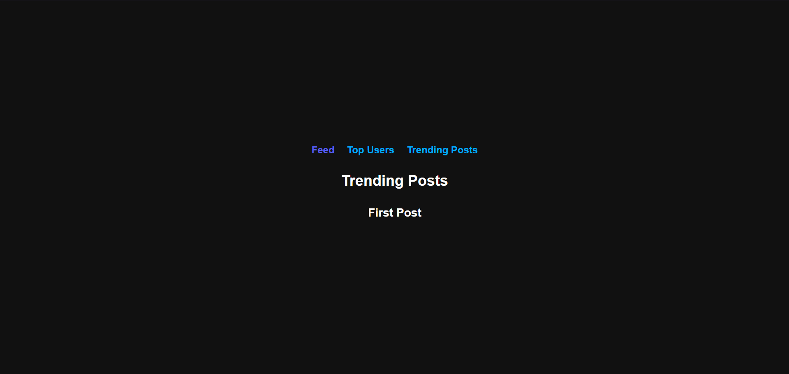
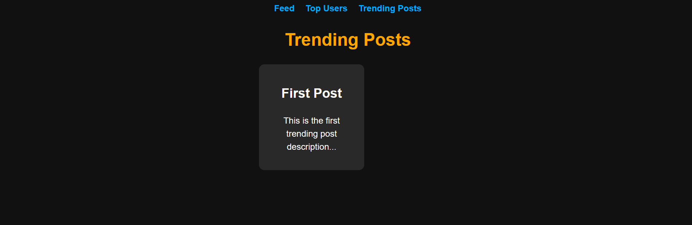

```md
# Social Media Analytics

A simple web application that displays **trending posts** and **top users** based on engagement.

## 🛠️ Tech Stack
- **Frontend**: React, JavaScript, CSS
- **Build Tool**: Vite
- **Routing**: React Router

## 🚀 Setup & Run
1. **Clone the repository**  
   ```sh
   git clone https://github.com/your-repo/trend-analysis.git
   cd trend-analysis
   ```
2. **Install dependencies**  
   ```sh
   npm install
   ```
3. **Run the project on port 3000**  
   Update `vite.config.js`:
   ```js
   export default defineConfig({
     server: { port: 3000 }
   });
   ```
   Then start the server:  
   ```sh
   npm run dev
   ```
   Open **[localhost:3000](http://localhost:3000)** in your browser.

## 📸 Screenshots
| Home Page | Error Page | Trending Posts |
|-----------|-----------|---------------|
|  |  |  |
